## 什么是 k 近邻？

k 近邻（K-NearestNeighbor，简称 KNN）算法应该是机器学习中最简单的一个算法了，不过它虽然简单，但也有很多优点，比如：

+ 思想极度简单；
+ 使用的数学知识很少（近乎为 0）
+ 对于一些特定的数据集有非常好的效果；
+ 可以解释机器学习算法使用过程中的很多细节问题；
+ 更完整地刻画机器学习应用的流程；

那什么是 K 近邻算法呢？我们来画一张图。

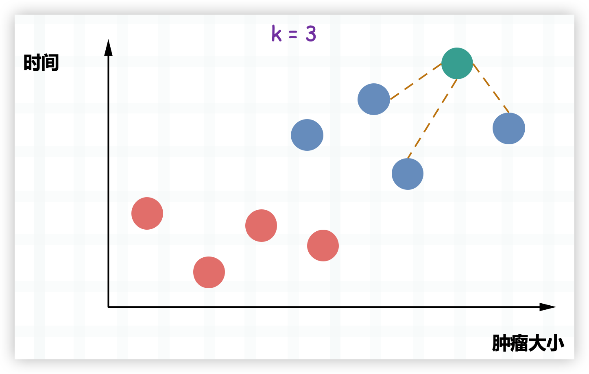

上图是以往病人体内的肿瘤状况，红色是良性肿瘤、蓝色是恶性肿瘤。显然这与发现时间的早晚以及肿瘤大小有密不可分的关系，那么当再来一个病人，我们怎么根据时间的早晚以及肿瘤大小推断出新的病人体内的肿瘤（图中的绿色）是良性的还是恶性的呢？

k 近邻的思想便可以在这里使用，我们选择离当前肿瘤最近的 k 个肿瘤，看看哪种肿瘤出现的次数最多。比如这里 k 取 3，那么就看离自己最近的 3 个肿瘤，哪一种出现的次数最多。显然它们都是蓝色，因此蓝色比红色等于 3 比 0，蓝色出现的次数最多，因此通过 k 近邻算法我们就可以得出这个肿瘤是恶性的。

所以这便是 K 近邻，可以说算法非常简单，就是寻找离当前样本最近的 k 个样本，看看这 k 个样本中哪个类别出现的次数最多。至于 k 到底取多少，显然没有一个统一的标准，这和数据集有很大关系。当然在实际工作中，我们也不可能只取一个值，而是会将 k 取不同的值进行反复尝试。

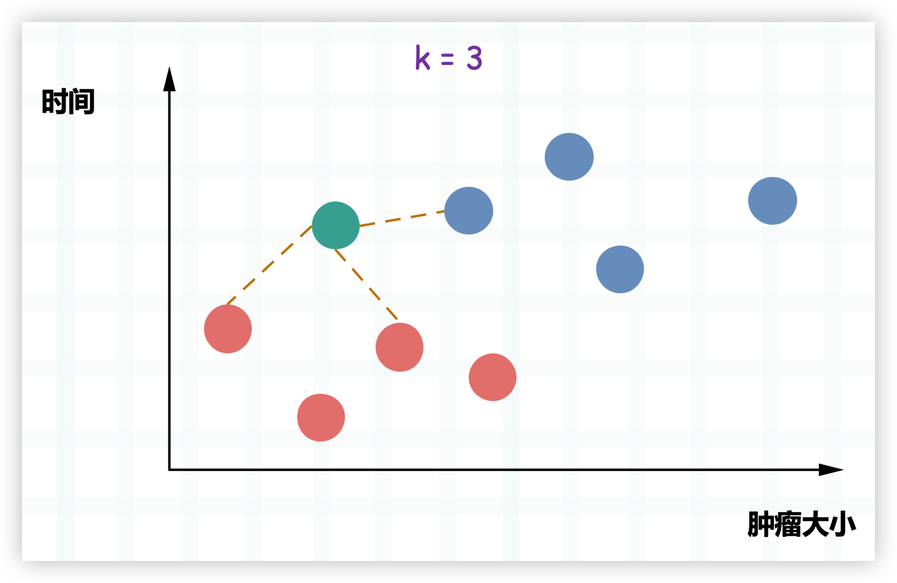

比如又来了一个肿瘤，但红色比蓝色等于 2 比 1，红色胜出，因此 k 近邻就告诉我们这个肿瘤很可能是一个良性肿瘤。

## 实现 k 近邻

k 近邻算法的基础概念我们已经了解了，下面通过代码来实现它。

~~~python
import numpy as np
import plotly.graph_objs as go

# 可以看做肿瘤的发现大小和时间
data_X = [[3.39, 2.33],
          [3.11, 1.78],
          [1.34, 3.37],
          [3.58, 4.68],
          [2.28, 2.87],
          [7.42, 4.70],
          [5.75, 3.53],
          [9.17, 2.51],
          [7.79, 3.42],
          [7.94, 0.79]]
# 可以看做是良性还是恶性
data_y = [0, 0, 0, 0, 0, 1, 1, 1, 1, 1]
# 转成 numpy 数组
data_X, data_y = np.array(data_X), np.array(data_y)

# 将良性肿瘤和恶性肿瘤对应的点都绘制在图中
# 良性肿瘤标记为红色，恶性肿瘤标记为蓝色
trace0 = go.Scatter(x=data_X[data_y == 0, 0], 
                    y=data_X[data_y == 0, 1], 
                    mode="markers", 
                    marker={"size": 15, "color": "red"})
trace1 = go.Scatter(x=data_X[data_y == 1, 0], 
                    y=data_X[data_y == 1, 1], 
                    mode="markers", 
                    marker={"size": 15, "color": "blue"})
fig = go.Figure(data=[trace0, trace1], 
                layout={"template": "plotly_dark", "showlegend": False})
fig.show()
~~~

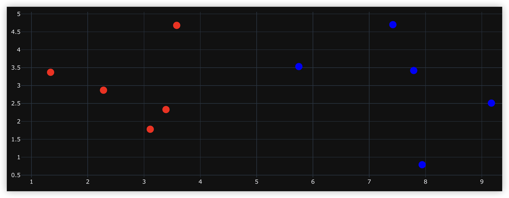

如果这个时候再来一个样本的话：

~~~Python
trace0 = go.Scatter(x=data_X[data_y == 0, 0], 
                    y=data_X[data_y == 0, 1], 
                    mode="markers", 
                    marker={"size": 15, "color": "red"})
trace1 = go.Scatter(x=data_X[data_y == 1, 0], 
                    y=data_X[data_y == 1, 1], 
                    mode="markers", 
                    marker={"size": 15, "color": "blue"})

# 我们使用绿色绘制
sample = np.array([[8.09, 3.37]])
trace2 = go.Scatter(x=sample[:, 0], 
                    y=sample[:, 1], 
                    mode="markers", 
                    marker={"size": 15, "color": "green"})
fig = go.Figure(data=[trace0, trace1, trace2], 
                layout={"template": "plotly_dark", "showlegend": False})
fig.show()
~~~

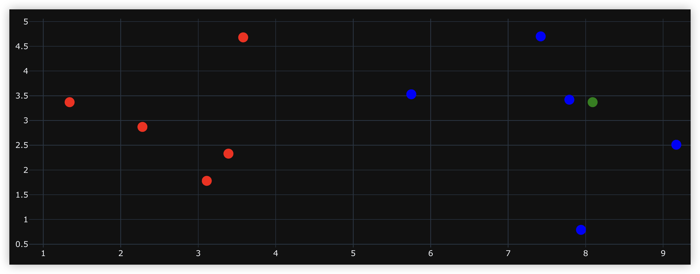

根据图像可以看出，这个新来的样本应该属于蓝色这一类。当然工作中肯定是要计算的，计算新的样本和已存在的所有样本之间的距离，然后选择最近（欧几里得距离最短）的 k 个，找到出现次数最多的种类即可。

~~~Python
data_X = [[3.39, 2.33],
          [3.11, 1.78],
          [1.34, 3.37],
          [3.58, 4.68],
          [2.28, 2.87],
          [7.42, 4.70],
          [5.75, 3.53],
          [9.17, 2.51],
          [7.79, 3.42],
          [7.94, 0.79]]
data_y = [0, 0, 0, 0, 0, 1, 1, 1, 1, 1]
data_X, data_y = np.array(data_X), np.array(data_y)
# 新来的样本
sample = np.array([[8.09, 3.37]])  
# 用于存放新来的样本和已存在的所有样本的距离
distances = np.sqrt(np.sum((data_X - sample) ** 2, axis=1))  
print(distances)
"""
[4.81368881 
 5.22766678 
 6.75       
 4.69640288 
 5.83147494 
 1.48922799
 2.34546371 
 1.38057959 
 0.30413813 
 2.58435679]
"""
~~~

每一个样本和新样本之间的距离就计算出来了，然后排序，选择最小的前三个。

~~~Python
# 注意：此时的 distances 和 data_y 是一一对应的，所以我们不能对 distances 这个数组排序
# 如果对 distances 进行排序的话，那么它和 data_y（样本标签）之间的对应的关系就被破坏了
# 因此我们需要按照值的大小来对索引排序
nearest = np.argsort(distances)
print(nearest) 
"""
[8 7 5 6 9 3 0 1 4 2]
"""
# 表示离自己最近的是 data_X 中索引为 8 的样本，第二近的是索引为 7 的样本。
# 选择离自己最近的 k 个样本，这里 k 取 6，然后获取它们的标签
topk_y = data_y[nearest[: 6]]
from collections import Counter
# 进行投票，选择出现次数最多的标签
votes = Counter(topk_y).most_common(1)[0]
print(f"标签 {votes[0]} 出现次数最多，出现 {votes[1]} 次") 
"""
标签 1 出现次数最多，出现 5 次
"""
~~~

以上便是使用 K 近邻算法对样本数据进行的一个简单预测，当然啦，我们还可以对其进行一个封装。

~~~Python
import numpy as np
from collections import Counter

def knn_classify(k: int,
                 data_X: np.ndarray,
                 data_y: np.ndarray,
                 sample: np.ndarray) -> str:
    """
    :param k: 选择多少个样本进行投票
    :param data_X: 训练样本
    :param data_y: 标签
    :param sample: 预测样本
    :return:   
    """
    assert 1 <= k <= data_X.shape[0], "k 必须大于等于 1，并且小于等于训练样本的总数量"
    assert data_X.shape[0] == data_y.shape[0], "训练样本的数量必须和标签数量保持一致"
    assert sample.shape[0] == data_X.shape[1], "预测样本的特征数必须和训练样本的特征数保持一致"

    distances = np.sqrt(np.sum((data_X - sample) ** 2, axis=1))
    nearest = np.argsort(distances)
    topK_y = data_y[nearest[: k]]
    votes = Counter(topK_y).most_common(1)[0]
    return f"该样本的特征为 {votes[0]}，在 {k} 个样本中出现了 {votes[1]} 次"

data_X = [[3.39, 2.33],
          [3.11, 1.78],
          [1.34, 3.37],
          [3.58, 4.68],
          [2.28, 2.87],
          [7.42, 4.70],
          [5.75, 3.53],
          [9.17, 2.51],
          [7.79, 3.42],
          [7.94, 0.79]]

data_y = [0, 0, 0, 0, 0, 1, 1, 1, 1, 1]

data_X = np.array(data_X)
data_y = np.array(data_y)
sample = np.array([8.09, 3.37])  # 新来的样本

print(knn_classify(3, data_X, data_y, sample))
"""
该样本的特征为 1，在 3 个样本中出现了 3 次
"""
~~~

到目前为止，我们便通过代码简单地实现了一下 K 近邻算法。

## 什么是机器学习？

我们说 k 近邻算法是一种机器学习算法，那机器学习是什么呢？机器学习就是我们输入大量的学习资料，然后通过机器学习算法（k 近邻只是其中之一）训练出一个模型，当下一个样例到来的时候，基于模型直接预测出结果。

所以整个过程分为如下几步：

+ 输入一定数量的样本（训练数据集），每个样本里面包含了样本特征和样本标签。
+ 通过机器学习算法，对样本进行训练得到模型（特征和标签之间的对应关系），这一过程我们称之为 fit（拟合）。
+ 输入新的样本，并根据上一步得到的模型来预测出结果，这一过程我们称之为 predict（预测）。

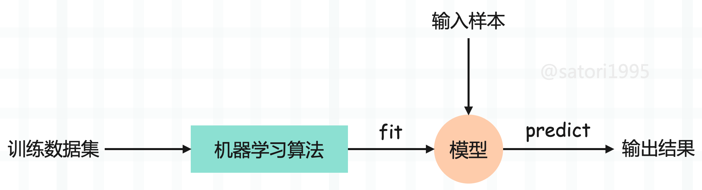

估计有人注意到了，我们在 k 近邻算法中，并没有看到训练模型这一步啊。因为 k 近邻算法是非常特殊的，可以认为是一个没有模型的算法，不过为了和其它算法统一，可以认为训练数据集本身就是模型。

因此我们还是为 k 近邻找到了一个 fit 的过程，这在 sklearn 中也是这么设计的。sklearn 里面封装了大量的算法，它们的设计理念都是一样的，都是先 fit 训练模型，然后 predict 进行预测。

### sklearn 中的 k 近邻算法

下面看看如何在 sklearn 中使用 k 近邻算法。

~~~Python
import numpy as np
from sklearn.neighbors import KNeighborsClassifier

# sklearn 里面所有的算法都是以面向对象的形式封装的
# 参数 n_neighbors 就是 k 近邻中的 k
knn = KNeighborsClassifier(n_neighbors=3)

raw_data_X = [[3.39, 2.33],
              [3.11, 1.78],
              [1.34, 3.37],
              [3.58, 4.68],
              [2.28, 2.87],
              [7.42, 4.70],
              [5.75, 3.53],
              [9.17, 2.51],
              [7.79, 3.42],
              [7.94, 0.79]]

raw_data_y = [0, 0, 0, 0, 0, 1, 1, 1, 1, 1]

X_train = np.array(raw_data_X)  # 样本特征
y_train = np.array(raw_data_y)  # 样本标签
# 传入数据集进行 fit，得到模型
knn.fit(X_train, y_train)

# 使用模型对新来的样本进行 predict
# 注意：在 sklearn 中，predict 必须要传递一个二维数组
# 哪怕只有一个样本，也要写成二维数组的模式
y_predict = knn.predict(np.array([[8.09, 3.37], [3.09, 7.37]]))

# 得到这两个样本的标签分别是 1 和 0
print(y_predict)  # [1 0]
~~~

总结一下就是：

+ 每个算法在 sklearn 中就是一个类，指定参数对类实例化。
+ 调用实例的 fit 方法，传入训练数据集的特征和标签，来训练出一个模型。这个方法会返回实例本身，当然我们也不需要单独使用变量接收。
+ fit 完毕之后，直接调用 predict，得到预测的结果。并且要注意的是，在 sklearn 中，要传入二维数组，哪怕只预测一个样本也要以二维数组的形式传递。

sklearn 的所有算法都保持这样的高度一致性，都是创建实例，然后 fit，再 predict。

### 封装自己的 k 近邻

我们也可以将之前写的 k 近邻算法封装成 sklearn 的模式。

~~~python
from collections import Counter
import numpy as np

class KnnClassifier:

    def __init__(self, k):
        assert k >= 1, "K必须合法"
        self.k = k
        # 用户肯定会传入样本集，因此提前写好
        self._X_train = None
        self._y_train = None

    def fit(self, X_train, y_train):
        assert X_train.shape[0] == y_train.shape[0], "训练样本的数量必须和标签数量保持一致"
        assert self.k <= X_train.shape[0], "K 必须小于等于训练样本的总数量"
        # 因为 K 近邻算法是一个不需要训练模型的算法，所以这里没有训练这一步
        self._X_train = X_train
        self._y_train = y_train

        # 这里完全可以不需要 return self，但为了和 sklearn 保持一致，我们还是加上这句
        # 为什么这么做呢？因为如果严格按照 sklearn 的标准来写的话
        # 那么我们自己写的算法是可以和 sklearn 中的其它算法无缝对接的
        return self

    def predict(self, X_predict):
        assert self._X_train is not None and self._y_train is not None, "predict 之前必须先 fit"
        if not isinstance(X_predict, np.ndarray):
            raise TypeError("传入的数据集必须是 np.ndarray 类型")

        predict = []
        # 因为可能来的不止一个样本
        for x in X_predict:
            distances = np.sqrt(np.sum((self._X_train - x) ** 2, axis=1))
            nearest = np.argsort(distances)
            votes = self._y_train[nearest[: self.k]]
            predict.append(Counter(votes).most_common(1)[0][0])

        # 遵循 sklearn 的标准，以 np.ndarray 的形式返回
        return np.array(predict)

    def __repr__(self):
        return f"KNN(k={self.k})"

    def __str__(self):
        return f"KNN(k={self.k})"

raw_data_X = [[3.39, 2.33],
              [3.11, 1.78],
              [1.34, 3.37],
              [3.58, 4.68],
              [2.28, 2.87],
              [7.42, 4.70],
              [5.75, 3.53],
              [9.17, 2.51],
              [7.79, 3.42],
              [7.94, 0.79]]

raw_date_y = [0, 0, 0, 0, 0, 1, 1, 1, 1, 1]

X_train = np.array(raw_data_X)
y_train = np.array(raw_date_y)
x = np.array([[8.09, 3.37],
              [5.75, 3.53]])  # 新来的点

knn = KnnClassifier(k=3)
knn.fit(X_train, y_train)
print(knn)  # KNN(k=3)
y_predict = knn.predict(x)
print(y_predict)  # [1 1]
~~~

怎么样，是不是很简单呢？我们以上便实现了一个自己的 KNN。

## 训练数据集、测试数据集

我们目前是将所有的数据集都拿来训练模型了，但是问题来了，如果训练出的模型很差怎么办？首先我们没有机会去调整，因为模型要在真实的环境中使用，并且也无法提前得知模型的好坏，在真实的环境中使用就只能听天由命了。其实说这些，意思就是将全部的数据集都用来训练模型是不合适的，因此可以将数据集进行分割，比如百分之 80 的数据集用来训练，百分之 20 的数据集用于测试。

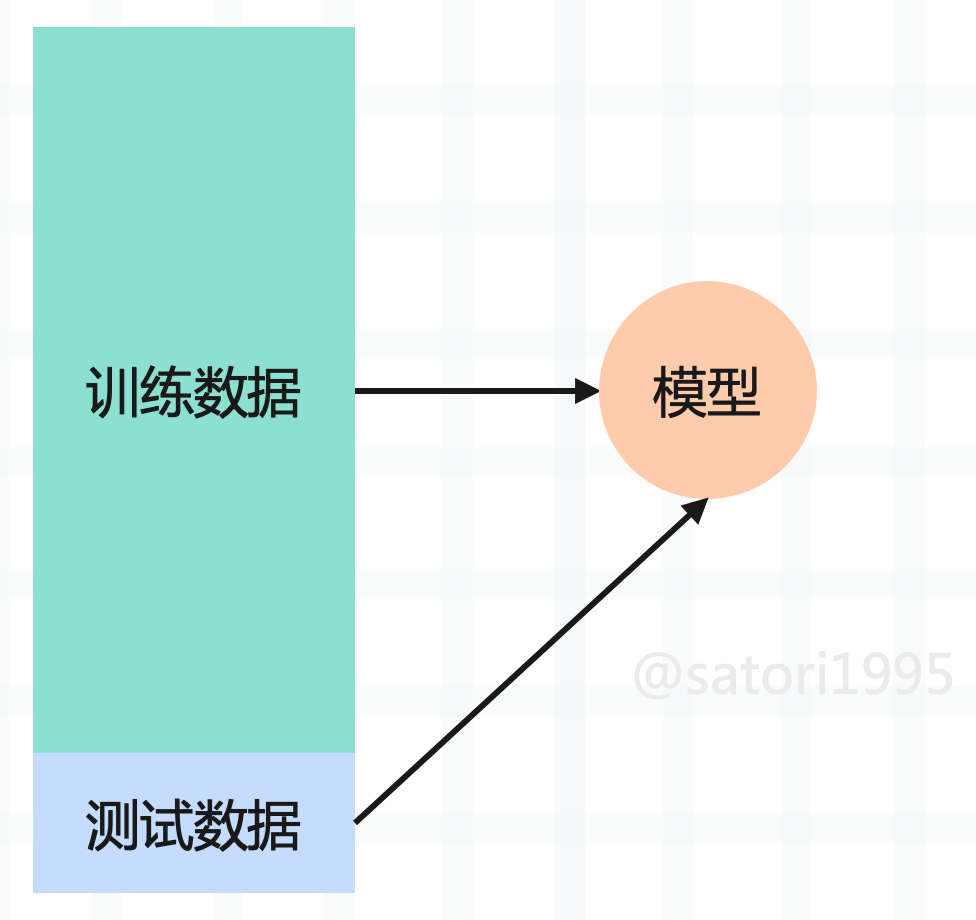

如果对测试数据集预测的不够好的话，说明算法还需要改进，这样就可以在进入真实环境之前改进模型。而将整个数据集分割成训练数据集合测试数据集这一过程我们称之为 train_test_split。而 sklearn 也提供了这样一个函数，不过我们也可以自己手动模拟一下。

~~~Python
from sklearn.datasets import load_iris
import numpy as np

def train_test_split(X, y, test_size=0.3):
    """
    对数据集进行切分，并且要随机切分
    :param X: 数据集
    :param y: 样本标签
    :param test_size: 测试集占的比例
    :return:
    """
    # 生成数据集对应的索引
    indexes = np.arange(X.shape[0])
    # 将 indexes 打乱，此时它们就是随机的了
    np.random.shuffle(indexes)
    # 计算测试集的长度
    test_count = int(test_size * X.shape[0])
    # 然后再用切片的方式进行筛选
    X_train, X_test = X[indexes[test_count:]], X[indexes[: test_count]]
    y_train, y_test = y[indexes[test_count:]], y[indexes[: test_count]]
    return X_train, X_test, y_train, y_test

# 实际验证一下
iris = load_iris()
X = iris.data  # 样本特征
y = iris.target  # 样本标签
print(X.shape, y.shape)  # (150, 4) (150,)
X_train, X_test, y_train, y_test = train_test_split(X, y)
print(X_train.shape, y_train.shape)  # (105, 4) (105,)
print(X_test.shape, y_test.shape)  # (45, 4) (45,)
~~~

将我们之前自己写的 k 近邻算法和切割数据集的代码组合起来，一部分用于训练，一部分用于预测。

~~~Python
from collections import Counter
import numpy as np
from sklearn.datasets import load_iris

class KnnClassifier:

    def __init__(self, k):
        assert k >= 1, "K必须合法"
        self.k = k
        self._X_train = None
        self._y_train = None

    def fit(self, X_train, y_train):
        assert X_train.shape[0] == y_train.shape[0], "训练样本的数量必须和标签数量保持一致"
        assert self.k <= X_train.shape[0], "K 必须小于等于训练样本的总数量"
        self._X_train = X_train
        self._y_train = y_train
        return self

    def predict(self, X_predict):
        assert self._X_train is not None and self._y_train is not None, "predict 之前必须先 fit"
        if not isinstance(X_predict, np.ndarray):
            raise TypeError("传入的数据集必须是 np.ndarray 类型")

        predict = []
        for x in X_predict:
            distances = np.sqrt(np.sum((self._X_train - x) ** 2, axis=1))
            nearest = np.argsort(distances)
            votes = self._y_train[nearest[: self.k]]
            predict.append(Counter(votes).most_common(1)[0][0])
        return np.array(predict)

    def __repr__(self):
        return f"KNN(k={self.k})"

    def __str__(self):
        return f"KNN(k={self.k})"

def train_test_split(X, y, test_size=0.3):
    indexes = np.arange(X.shape[0])
    np.random.shuffle(indexes)
    test_count = int(test_size * X.shape[0])
    X_train, X_test = X[indexes[test_count:]], X[indexes[: test_count]]
    y_train, y_test = y[indexes[test_count:]], y[indexes[: test_count]]
    return X_train, X_test, y_train, y_test

iris = load_iris()
X = iris.data  # 样本特征
y = iris.target  # 样本标签
X_train, X_test, y_train, y_test = train_test_split(X, y)  # 分割数据集
knn = KnnClassifier(k=3)
knn.fit(X_train, y_train)  # 训练
y_predict = knn.predict(X_test)  # 预测
# 将对测试集进行预测的结果和已知的结果进行比对
print(f"测试样本总数：{len(X_test)}, "
      f"预测正确的数量：{np.sum(y_predict == y_test)}, "
      f"预测准确率：{np.sum(y_predict == y_test) / len(X_test)}")
"""
测试样本总数：45, 预测正确的数量：44, 预测准确率：0.9777777777777777
"""
~~~

当然 sklearn 已经为我们提供了 train_test_split，来看一下。

~~~Python
from sklearn.model_selection import train_test_split
from sklearn.datasets import load_iris

iris = load_iris()
X = iris.data
y = iris.target
X_train, X_test, y_train, y_test = train_test_split(X, y, test_size=0.3)
print(X_train.shape, y_train.shape)  # (105, 4) (105,)
print(X_test.shape, y_test.shape)  # (45, 4) (45,)
~~~

用法和效果我们自定义的一样，并且 sklearn 中的 train_test_split 可以接收更多的参数，比如还可以设置一个random_state，表示随机种子。

以上就是训练集和测试集的内容，训练集进行训练，测试集进行测试。如果在测试集上表现完美的话，我们才会投入生产环境使用，如果表现不完美，那么我们可能就要调整算法，或者调整参数了。

## 分类准确度

评价一个算法的好坏，可以使用分类准确度来实现，如果预测正确的样本个数越多，那么说明算法越好。所以我们可以实现的 K 近邻算法中定义一个 score 方法，根据预测的准确度来给模型打一个分。

~~~python
from collections import Counter
import numpy as np
from sklearn.model_selection import train_test_split
from sklearn.datasets import load_iris

class KnnClassifier:

    def __init__(self, k):
        assert k >= 1, "K必须合法"
        self.k = k
        self._X_train = None
        self._y_train = None

    def fit(self, X_train, y_train):
        assert X_train.shape[0] == y_train.shape[0], "训练样本的数量必须和标签数量保持一致"
        assert self.k <= X_train.shape[0], "K 必须小于等于训练样本的总数量"
        self._X_train = X_train
        self._y_train = y_train
        return self

    def predict(self, X_predict):
        assert self._X_train is not None and self._y_train is not None, "predict 之前必须先 fit"
        if not isinstance(X_predict, np.ndarray):
            raise TypeError("传入的数据集必须是 np.ndarray 类型")

        predict = []
        for x in X_predict:
            distances = np.sqrt(np.sum((self._X_train - x) ** 2, axis=1))
            nearest = np.argsort(distances)
            votes = self._y_train[nearest[: self.k]]
            predict.append(Counter(votes).most_common(1)[0][0])
        return np.array(predict)

    def score(self, X_test, y_test):
        y_predict = self.predict(X_test)
        # 预测正确的个数除以总个数
        return np.sum(y_test == y_predict) / len(y_test)

    def __repr__(self):
        return f"KNN(k={self.k})"

    def __str__(self):
        return f"KNN(k={self.k})"

iris = load_iris()
X = iris.data  # 样本特征
y = iris.target  # 样本标签
X_train, X_test, y_train, y_test = train_test_split(X, y)  # 分割数据集
knn = KnnClassifier(k=3)
knn.fit(X_train, y_train)  # 训练
print(knn.score(X_test, y_test))  # 0.9736842105263158
~~~

通过封装一个 score 方法，直接对模型打分。当然也可以调用 predict 获取预测值，然后将预测值和真实值进行比对，手动计算分数。但如果只想知道模型的好坏，那么可以调用 score 方法，传入测试集 X_test 和 y_test，然后 score 方法内部会自动调用 predict，根据 X_test 预测出 y_predict，然后通过 y_predict 和 y_test 计算出分数。

关于计算分数，sklearn 其实也提供了相应的方法。

~~~Python
from sklearn.metrics import accuracy_score
iris = load_iris()
X = iris.data  # 样本特征
y = iris.target  # 样本标签
X_train, X_test, y_train, y_test = train_test_split(X, y)  # 分割数据集
knn = KnnClassifier(k=3)
knn.fit(X_train, y_train)  # 训练
y_predict = knn.predict(X_test)  # 预测
# 将 y_test 和 y_predict 进行比较
print(accuracy_score(y_test, y_predict))  # 0.9736842105263158
~~~

以上就是分类准确度，因为要有一个指标，来验证模型的好坏。

## 超参数

对于已经实现好的算法，我们一般不会重复造轮子，当然一些特定场景除外。不过在使用 sklearn 的 k 近邻算法（KNeighborsClassifier）时，我们只传递了一个 n_neighbors 参数，也就是 k 近邻中的 k。实际上这个 n_neighbors 参数也是可以不传的，因为会有一个默认值，默认值是 5。而除了 n_neighbors 之外还有很多其它参数，而这些参数就是超参数。所谓超参数，指的是那些在 fit 之前就需要指定的参数。

**说起超参数就不得不提模型参数，这两者区别是什么呢？**

- 超参数：在算法运行前（或者说在 fit 之前）需要决定的参数，比如 k 近邻算法中的 k 就是典型的超参数。
- 模型参数：算法过程中学习的参数。

k 近邻算法比较特殊，它没有模型参数，因为数据集本身就可以看做成一个模型。但是后续的算法中，比如线性回归算法，都会包含大量的模型参数。

那么如何寻找更好的超参数呢？在机器学习中，我们经常会听到一个词叫"调参"，这个调参调的就是超参数，因为这是在算法运行前就需要指定好的参数。而寻找好的超参数一般有三种办法：

- 领域知识：这个是根据所处的领域来决定的，比如文本处理，视觉领域等等，不同的领域会有不同的超参数。
- 经验数值：根据以往的经验，比如 sklearn的 k 近邻算法中，默认的 k 就是 5，这个是根据经验决定的。另外 sklearn 的每个算法中都有大量的超参数，并且大部分都有默认值，这些默认值是 sklearn 根据以往的经验选择的最佳默认值。
- 实验搜索：如果无法决定的话，那么就只能通过实验来进行搜索了，对超参数取不同的值进行测试、对比，寻找一个最好的超参数。

我们来暴力搜索一下吧：

~~~Python
from sklearn.datasets import load_digits
from sklearn.model_selection import train_test_split
from sklearn.neighbors import KNeighborsClassifier

digits = load_digits()
X = digits.data
y = digits.target

X_train, X_test, y_train, y_test = train_test_split(X, y, test_size=0.3)

def search_best_k():
    best_score = 0.0
    best_k = -1
    for k in range(1, 11):
        # k分别从1取到10
        knn_clf = KNeighborsClassifier(n_neighbors=k)
        knn_clf.fit(X_train, y_train)  # fit
        score = knn_clf.score(X_test, y_test) # 得到score
        if score > best_score:
            best_score = score
            best_k = k
    return f"the best score is {best_score}, k is {best_k}"

print(search_best_k())  # the best score is 0.9888888888888889, k is 5
~~~

以上便是调参的过程，通过对不同的超参数取值，确定一个最好的超参数。当然我的这里得出来的是 5，可能你在计算之后，得到的结果会有所差异。

但如果得到 k 是10，这就意味着此时的 k 值处于边界，那么我们不确定边界之外的值对算法的影响如何，可能 10 以后的效果会更好，因此还需要对 10 以外的值进行判断。总之在参数值取到我们给定范围的边界时，还需要稍微地再拓展一下，扩大搜索范围，对边界之外的值进行检测、判断，看看能否得到更好的超参数。

### k 近邻的其他超参数

**实际上，k 近邻算法不止一个超参数，还有一个很重要的超参数，就是距离。仍以肿瘤为例：**

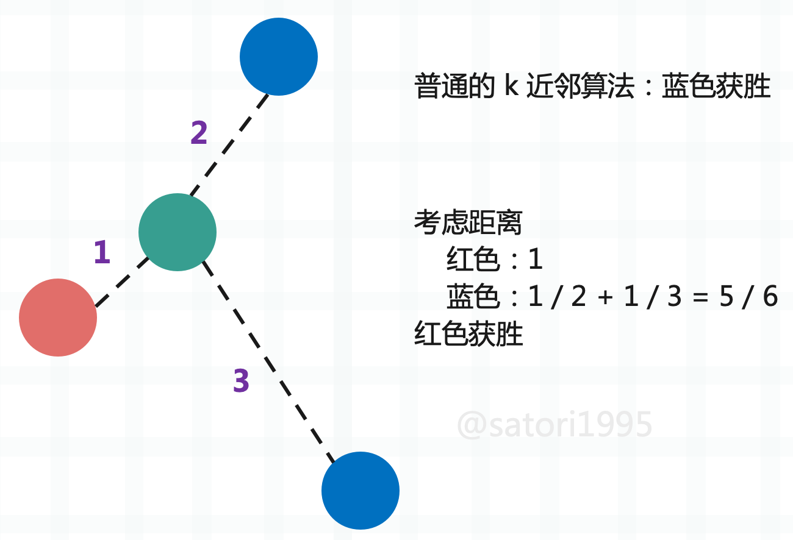

按照之前讲的，在 k 取 3 的时候，蓝色有两个，红色有 1 个，那么蓝色比红色是 2 比 1，所以蓝色获胜。但我们忽略了一个问题，那就是距离，这个绿色是不是离红色更近一些呢？一般肿瘤发现时间和大小比较接近的话，那么肿瘤的性质也类似，而蓝色虽然有两个，但离绿色都比较远。所以如果还用个数投票的话，那么显然是不公平的，此时应该把距离也考虑进去，而距离近的，相应的权重也要更大一些。因此可以采用距离的倒数进行计算，这样做的话会发现是红色胜出。

另外采用距离的倒数，还可以有一个好处，那就是解决平票的问题。假设绿色周围都是不同的颜色，那么我们依旧可以根据距离得出结果。如果是根据数量，那么显然每个样本都是 1，此时就平票了。

**下面我们看一下 sklearn 中的 KNeighborsClassifier 都有哪些参数。**

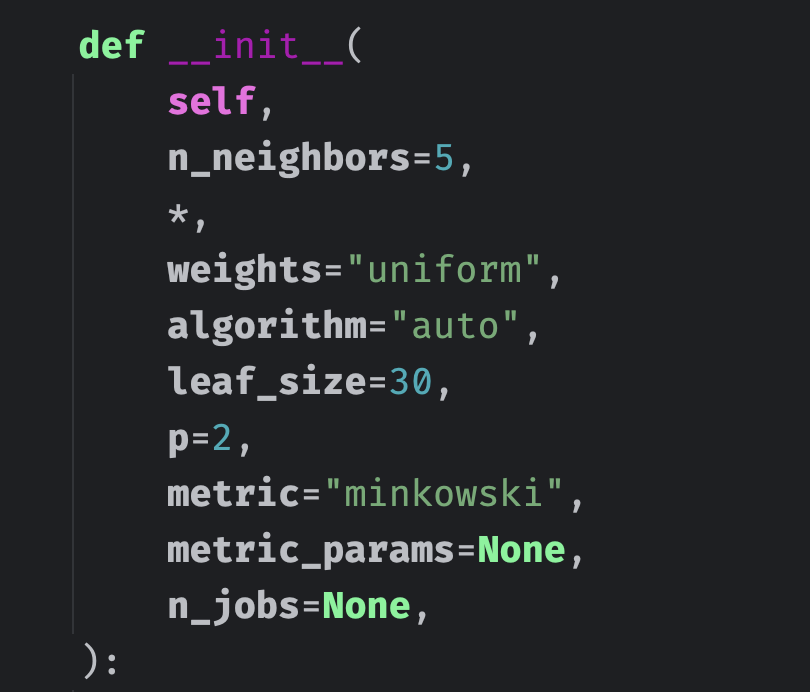

+ n_neighbors：k 近邻算法当中的 k，指定以几个最近的样本具有投票权。较小的 k 值使模型更敏感于噪声，较大的 k 值使决策边界更平滑。
+ weights：每个拥有投票权的样本按照什么比重投票，有以下几种选择。
  + "uniform"：表示等比重，也就是不考虑距离，每一个成员的权重都是一样的。
  + "distance"：就是之前说的按照距离的反比进行投票。
  + 也可以传入一个自定义的权重计算函数。
+ algorithm：使用哪种算法计算距离最近的 k 个样本点，有以下几种选择。
  + "ball_tree"：球树。
  + "kd_tree"：kd 树。
  + "brute"：暴力搜索，计算所有样本点之间的距离。
  + "auto"：根据数据类型和结构自动选择合适的算法，一般来说，低维数据和中维数据用 "kd_tree"，高维数据用 "ball_tree"。
+ leaf_size：ball_tree 或者 kd_tree 的叶子节点规模，该参数会影响树的构建速度、查询速度，以及存储树所需的内存。
+ matric：怎样度量距离，默认是闵可夫斯基距离，即闵式距离。
+ p：闵式距离中的距离参数，后面会说。
+ metric_params：作为额外关键字参数传递给距离度量函数的参数字典，一般默认为 None，不用管。
+ n_jobs：并行的任务数，默认使用 1 个核心，指定为 -1 则表示使用所有核心。

**一般来说，n_neighbors、weights、p 这三个参数对于调参来说是最常用的。**

### 更多关于距离的定义

我们之前讨论的距离，显然都是欧几里得距离，说白了就是两点确认一条直线，这条直线的长度便是两点之间的欧几里得距离。那么下面我们介绍更多的距离。

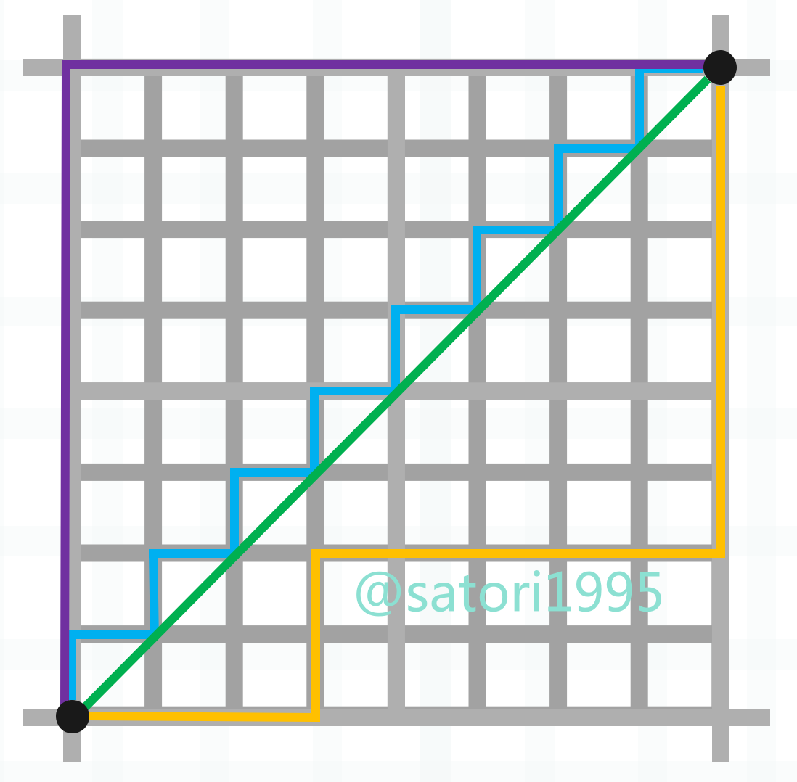

图中的绿色线段便是两点之间的欧几里得距离，这个比较简单。然后蓝色、紫色、橙色线段表示两点之间的曼哈顿距离，也就是各个维度上的距离之和，显然蓝色、紫色、橙色三条线段的长度是相等的。

每个维度的距离之和是曼哈顿距离，每个维度的距离的平方之和再开平方是欧几里得距离，而每个维度的距离的 p 次方之和再开 p 次方便是闵可夫斯基距离。

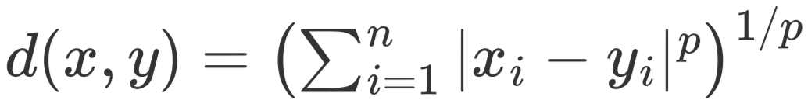

所以不难发现，曼哈顿距离和欧几里得距离正是闵可夫斯基距离在 p 取 1 和 2 时的特殊情况。

+ 当 p = 1 时，闵可夫斯基距离等同于曼哈顿距离（Manhattan distance），也称为 L1 范数或城市街区距离。
+ 当 p = 2 时，闵可夫斯基距离等同于欧几里得距离（Euclidean distance），也称为 L2 范数。

而这里的 p 便对应 sklearn 的 k 近邻实现中的参数 p，当参数 metric 为 "minkowski" 时，可以通过参数 p 来调整具体使用哪种距离度量方式。当需要曼哈顿距离时，可以将 p 指定为 1，而默认值为 2，说明默认采用的是欧几里得距离。

> 当需要曼哈顿距离时，也可以直接将 metric 指定为 "manhattan"，不过一般我们都调整参数 p。

**我们使用 Numpy 来计算这几个距离：**

~~~Python
import numpy as np

def minkowski_distance(x, y, p):
    return np.sum(np.abs(x - y) ** p) ** (1 / p)

x = np.array([1, 3, 2, 7])
y = np.array([3, -4, 9, 6])
# 曼哈顿距离
print(minkowski_distance(x, y, 1))  # 17.0
# 欧几里得距离
print(minkowski_distance(x, y, 2))  # 10.14889156509222
print(minkowski_distance(x, y, 3))  # 8.857848910564961
~~~

比较简单，不多说了。

### 搜索最好的参数 p

如果将 weights 设置为 "distance"，那么不仅要考虑 k，还要考虑 p，我们测试一下。

~~~python
from sklearn.datasets import load_digits
from sklearn.model_selection import train_test_split
from sklearn.neighbors import KNeighborsClassifier

digits = load_digits()
X = digits.data
y = digits.target

X_train, X_test, y_train, y_test = train_test_split(X, y, test_size=0.3)

def search_best_k():
    best_p = -1
    best_score = 0.0
    best_k = -1

    for k in range(1, 11):
        # 既然指定了 p，显然是考虑距离的，那么 weights 就必须直接指定为 "distance"，不然 p 就没有意义了
        for p in range(1, 6):
            knn_clf = KNeighborsClassifier(n_neighbors=k, weights="distance", p=p)
            knn_clf.fit(X_train, y_train)
            score = knn_clf.score(X_test, y_test)
            if score > best_score:
                best_score = score
                best_k = k
                best_p = p
    return f"the best score is {best_score}, k is {best_k}, p is {best_p}"

print(search_best_k())  # the best score is 0.9888888888888889, k is 5, p is 2
~~~

找到的 k 是 5，p 是 2，这和默认参数是一致的，因此 sklearn 参数的默认值设置的还是比较好的。另外由于数据集比较简单，你在测试的时候结果可能会和我这里不一样。

不过对于像 p 这种参数，说实话一般不常用。比如 sklearn 中其它的算法，都有很多超参数，但有的参数我们一般很少会用，而且这些参数都会有默认值，并且是 sklearn 根据经验给你设置的最好或者比较好的默认值，这些参数不需要改动。比如 k 近邻中的 algorithm 和 leaf_size，这些真的很少会使用，直接使用默认的就行。但是像 n_neighbors 之类的，放在参数最前面的位置，肯定是重要的，我们需要了解原理、并且在搜索中也会经常使用。

这个搜索过程就叫做网格搜索，比如图中的 k 和p，通过 k、p 取不同的值，这些值按照左右和上下的方向连起来就形成了一个网格，网格上的每个点所代表的就是每一个 k 和 p。

## 网格搜索与K近邻算法中更多超参数

事实上，超参数之间也是有依赖的，比如在 k 近邻算法中，我们如果指定 p 的话，那么就必须要将 weights 指定为 "distance"，如果不指定，那么 p 就没有意义了。因此这种情况比较麻烦，怎么才能将我们所有的参数都列出来，只运行一次就得到最好的超参数呢？显然自己实现是完全可以的，就再写一层 for 循环嘛。但 sklearn 针对这种网格搜索，专门封装了一个函数，使用这个函数，就能更加方便地找到最好的超参数。

~~~python
from sklearn.datasets import load_digits
from sklearn.model_selection import train_test_split
from sklearn.neighbors import KNeighborsClassifier
from sklearn.model_selection import GridSearchCV

digits = load_digits()
X = digits.data
y = digits.target

X_train, X_test, y_train, y_test = train_test_split(X, y, test_size=0.3, random_state=666)
# 定义网格搜索的参数，参数以字典的形式传入
# 由于会有多个值，因此 value 都要以列表（可迭代）的形式，哪怕只有一个参数，也要以列表的形式
# 之前说有些参数依赖于其它参数，比如这里的 p，必须在 weights="distance" 的时候才会起作用
# 那么就可以分类，将多个字典放在一个列表里面（即便只有一个字典，也要放在列表里面）
param_grid = [
    {
        "weights": ["uniform"],
        "n_neighbors": list(range(1, 11))
    },

    {
        "weights": ["distance"],
        "n_neighbors": list(range(1, 11)),
        "p": list(range(1, 6))
    }
]

# 创建一个实例，不需要传入任何参数
knn = KNeighborsClassifier()

# 会发现这个类后面有一个 CV，这个 CV 暂时不用管，后面介绍
# 创建一个实例，里面传入我们创建的 estimator 和 param_grid 即可
# estimator 是啥？前面说了，每一个算法在 sklearn 中都被封装成了一个类，根据这个类创建的实例就叫做 estimator（分类器）
grid_search = GridSearchCV(knn, param_grid, n_jobs=-1)  # n_jobs=-1 表示使用所有的核进行搜索

# 让 grid_search 来 fit 我们的训练集，会用不同的超参数来进行 fit
# 这些超参数就是我们在 param_grid 当中指定的超参数
grid_search.fit(X_train, y_train)

# 打印最佳的分数
print(grid_search.best_score_)
# 打印最佳的参数
print(grid_search.best_params_)
"""
0.9920445203313729
{'n_neighbors': 1, 'weights': 'uniform'}
"""
~~~

以上我们便找到了最佳的分数和最佳的参数，在 weights 为 "distance" 的时候，我们知道最好的超参数是 n_neightbors 为 5、p 为 2，但显然将 weights 设置为默认的 "uniform" 会更合适一些，此时 n_neightbors 为 1。

我们直接将 grid_search.best_params_ 这个字典打散传入到 KNeighborsClassifier 中即可得到使用最好的超参数创建的 estimator，当然 sklearn 也想到了这一点，已经提前帮我们做好了。

~~~Python
# 打印最佳的分类器
print(grid_search.best_estimator_)
"""
KNeighborsClassifier(n_neighbors=1)
"""
# 等价于：KNeighborsClassifier(**grid_search.best_params_)
~~~

因此这便是网格搜索，说白了就是暴力尝试，如果想查看更详细的信息可以在 GridSearchCV 中加上一个 verbose 参数。这个参数表示输出详细信息，接收一个数字，值越大，输出信息越详细，一般传入 2 就行。有兴趣可以自己尝试一下，看看都输出了哪些信息。

另外我们看到像 best_score\_、best_params\_、best_estimator\_ 这些参数的结尾都加上了一个下划线，这是 sklearn 中的一种命名方式。结尾带有下划线的属性，表示它不是由用户传递的，而是根据其它参数在 fit 的时候生成的，并且还可以提供给外界进行访问，这样的属性会在结尾处加上一个下划线。

## 数据归一化

有些时候，不同维度的数据的量纲是不一样的，就拿肿瘤的例子来举例。

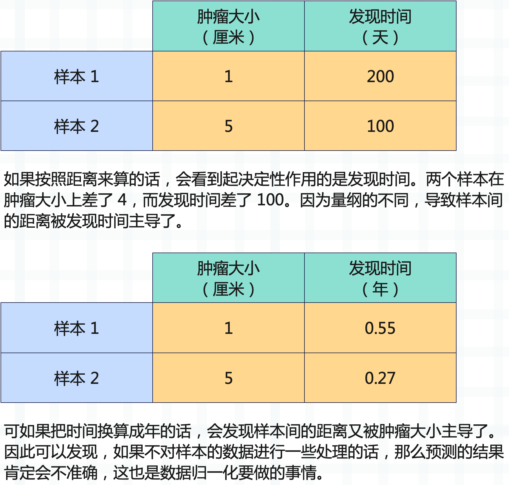

那么数据归一化都有哪些手段呢？

**最值归一化：将所有的数据都映射到 0 ~ 1 之间。**

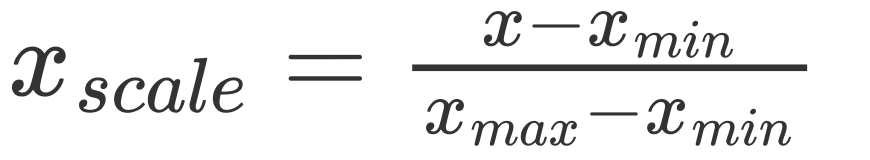

这种归一化适用于有明显边界的情况，比如学生的考试成绩，一般是 0 到 100 分；再比如图像的像素点，一般是 0 到 255，这些情况是适合最值归一化的。而对于那些没有明显边界的情况的话，则不适合了，比如收入。大部分人收入假设是一个月一万元，但是一个哥们比较niubility，他月薪十万。因此边界过大，那么大部分人就都被映射到了0.1左右，显然这种情况是不适合最值归一化的。

**零均值标准化：或者叫均值标准差归一化，把所有数据都映射到均值为 0 标准差为 1 的分布中，这种归一化的方式则可以解决边界问题。当然即便没有明显边界，比如学生的成绩等等，也可以使用这种方法。**

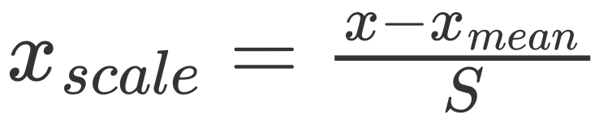

对于那些量纲不一致的数据集，我们要进行归一化，那么如何体现在训练数据集和测试数据集上面呢。很容易想到，对训练数据集求出均值和标准差，归一化之后训练模型。然后再对测试数据集求出均值和标准差，归一化之后进行预测不就可以了吗？但其实这样稍稍有点问题。

那就是在对测试数据集进行归一化时，使用的仍是训练数据集的均值和标准差，因为数据的归一化也是算法的一部分。而归一化在 sklearn 中也提供了相应的算法，并且被封装成了一个类，和其它算法的格式是类似的，在 sklearn 中，所有算法都保证了格式的统一。

~~~Python
from sklearn.datasets import load_iris
from sklearn.model_selection import train_test_split
from sklearn.preprocessing import StandardScaler
from sklearn.neighbors import KNeighborsClassifier

iris = load_iris()
X = iris.data
y = iris.target

X_train, X_test, y_train, y_test = train_test_split(X, y, test_size=0.3)

std_sca = StandardScaler()
# 这一步相当于计算出 X_train 中的 mean 和 std
std_sca.fit(X_train)

# 查看均值和标准差
# 还记得这种结尾带下划线的参数吗？表示这种类型的参数不是我们传进去的，而是计算的时候生成的，并提供给外界使用
print(std_sca.mean_)  # [5.85428571 3.08190476 3.73428571 1.19333333]
# 这里的 scale_ 指的就是标准差
print(std_sca.scale_)  # [0.83689091 0.44950363 1.76267268 0.77191989]

# 调用 transform 方法，对数据进行转化
scale_X_train = std_sca.transform(X_train)
scale_X_test = std_sca.transform(X_test)

knn_clf = KNeighborsClassifier()
# 对归一化之后的数据进行 fit
knn_clf.fit(scale_X_train, y_train)
# 对归一化之后的数据进行打分
score = knn_clf.score(scale_X_test, y_test)
print(score)  # 0.9777777777777777

# 需要注意，如果对训练数据集做了归一化处理，那么也要对测试集做归一化处理，否则结果肯定是不准确的
# 我们可以尝试使用原始的测试集进行预测，看看结果如何
print(knn_clf.score(X_test, y_test))  # 0.3333333333333333
# 可以看到结果的分数只有 0.333
~~~

上面的 StandardScaler 用于零均值标准化，还有 MinMaxScaler 用于最值归一化等等。

## 更多有关 k 近邻算法的思考

到目前为止，我们对 k 近邻算法算是有了一个清晰的认识了，那么K近邻算法都有哪些优点和缺点呢？

**优点**

有些算法不适合解决分类问题，或者只适合解决二分类问题，而 k 近邻天然可以解决多分类问题。而且思想简单，功能强大。

不仅如此，k 近邻还可以解决回归问题。我们知道回归问题和分类问题不同，分类问题是从有限的种类中预测出一个类别，而回归问题则是从无限的数字中预测出一个具体的值。

这里可能有人好奇了，既然数字是无限的，那 k 近邻是怎么解决回归问题的呢？

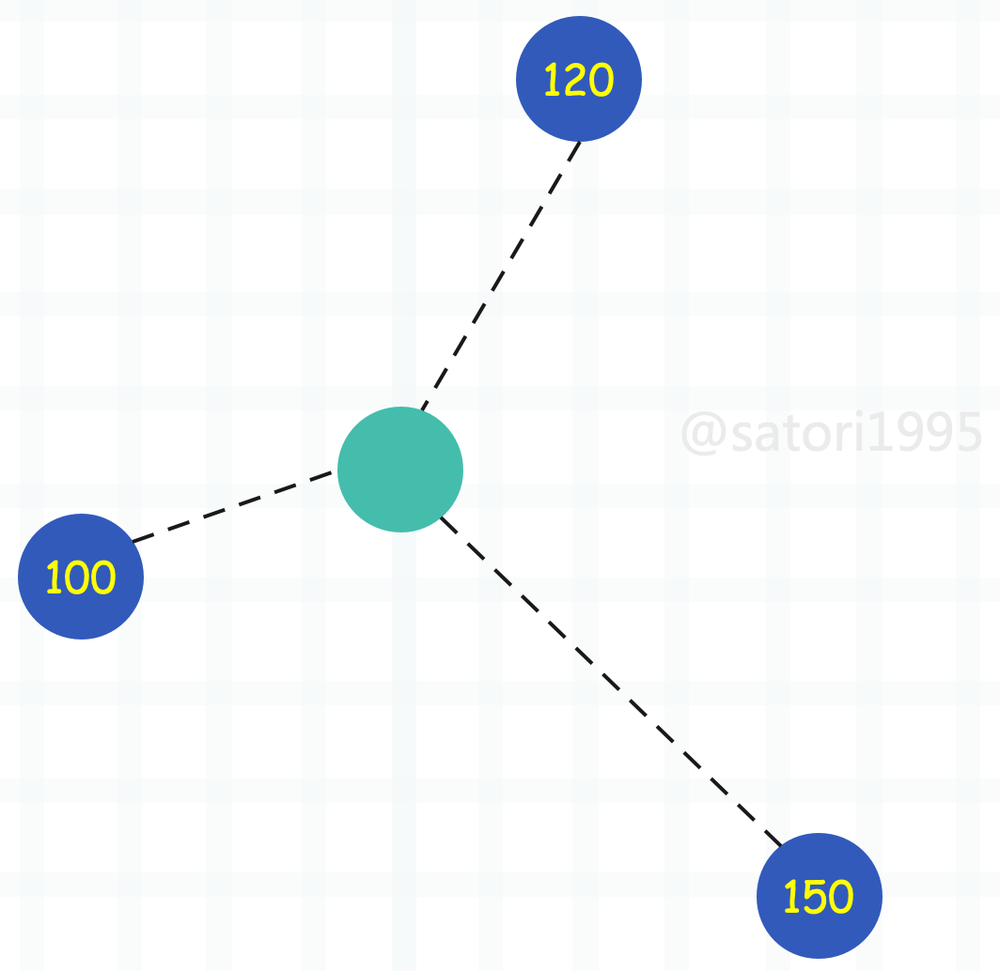

比如绿色的周围有三个点，那么 k 近邻可以取其平均值作为预测值，当然也可以考虑距离，采用加权平均的方式来计算。事实上 sklearn 不仅提供了 KNeighborsClassifier（k 近邻分类），还提供了 KNeighborsRegressor（k 近邻回归），关于回归会在后面介绍。

**缺点**

最大的缺点就是效率低下，如果训练集有 m 个样本，n 个特征，那么预测一个新的数据的时间复杂度就是 O(m \* n)。因为要和样本的每一个维度进行相减，然后平方相加、开方，然后 m 个样本重复相同的操作。优化的话，可以使用树结构：KD-Tree，Ball-Tree，但即便如此，效率依旧不高。

第二个缺点是高度数据相关，理论上，所有的数据都是高度相关的，但 k 近邻对数据更加敏感。尤其是数据边界，哪怕只有一两个数据很远，也足以让我们的预测结果变得不准确，即使存在大量的正确样本。

第三个缺点是预测结果不具有可解释性。

第四个缺点是维度灾难，随着维度的增加，看似相近的两个点之间的距离会越来越大。

## 小结

由于 k 近邻是我们学习的第一个算法，也是最简单的算法，所以我们把机器学习中的一些其它知识也放在这里介绍了。下面来回顾一下流程：

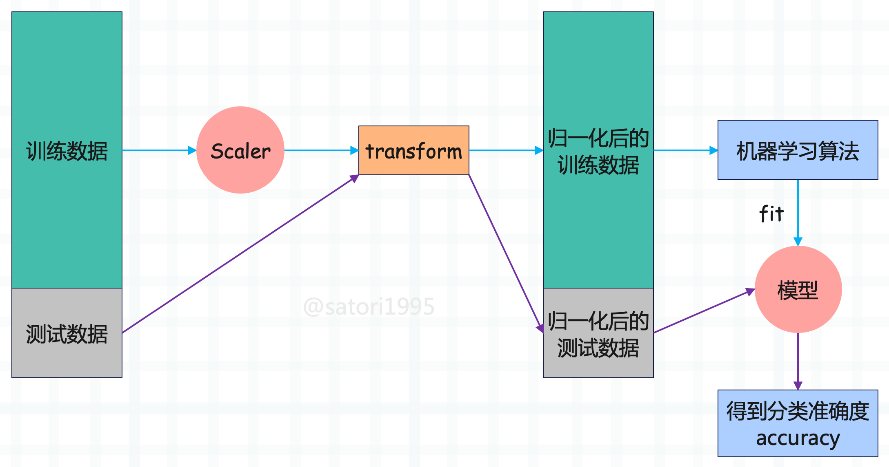

总结一下就是：

- 将数据集分成训练集和测试集。
- 对训练集进行归一化，然后训练模型。
- 对测试集使用同样的 scaler 进行归一化，然后送到模型里面。
- 网格搜索，通过分类准确度来寻找一个最好的超参数。
